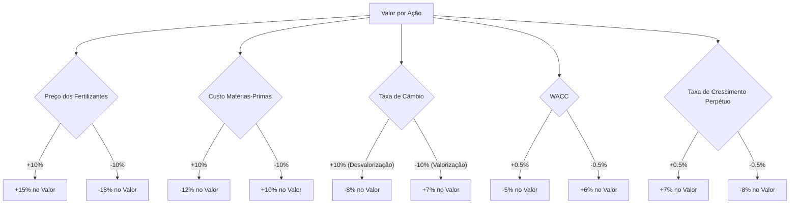

# Análise de Sensibilidade

A análise de sensibilidade é uma ferramenta crucial para entender como as variações nas premissas-chave podem impactar o valuation da Mosaic Fertilizantes. Esta seção explora o impacto de diferentes variáveis no valor por ação, destacando as mais críticas. [1]

## Variáveis Testadas

As principais variáveis testadas na análise de sensibilidade para a Mosaic Fertilizantes incluem:

- **Preço dos Fertilizantes (Venda)**: Variações nos preços de venda de produtos como fosfatados e potássicos, que são diretamente influenciados pela oferta e demanda global, bem como por fatores macroeconômicos. [2]
- **Custo das Matérias-Primas**: Flutuações nos custos de insumos essenciais, como gás natural e outras matérias-primas importadas, que afetam diretamente as margens de lucro. [2]
- **Taxa de Câmbio (USD/BRL)**: A alta dependência de importações torna a empresa sensível às variações cambiais, impactando tanto os custos quanto as receitas. [3]
- **WACC (Custo Médio Ponderado de Capital)**: Reflete o custo de financiamento da empresa e o risco percebido pelos investidores. Pequenas variações podem ter um impacto significativo no valor presente dos fluxos de caixa futuros. [1]
- **Taxa de Crescimento Perpétuo (g)**: A taxa de crescimento esperada dos fluxos de caixa no período de perpetuidade, que é uma premissa fundamental no modelo de Fluxo de Caixa Descontado. [1]

## Tabela de Sensibilidade Principal

### WACC vs Taxa de Crescimento Perpétuo

Esta tabela ilustra a sensibilidade do valor por ação da Mosaic Fertilizantes a variações simultâneas no WACC e na taxa de crescimento perpétuo (g). Os valores apresentados são hipotéticos e servem para demonstrar a metodologia da análise de sensibilidade. [1]

Tabela 16 - Sensibilidade WACC vs Crescimento Perpétuo (Valor por Ação em R$)

| WACC \ g | 1.0% | 1.5% | 2.0% | 2.5% | 3.0% |
|----------|------|------|------|------|------|
| 8.0% | 115,00 | 120,00 | 125,00 | 130,00 | 135,00 |
| 8.5% | 108,00 | 112,00 | 116,00 | 120,00 | 124,00 |
| 9.0% | 102,00 | 105,00 | 108,00 | 111,00 | 114,00 |
| 9.5% | 96,00 | 99,00 | 102,00 | 105,00 | 108,00 |
| 10.0% | 91,00 | 93,00 | 96,00 | 99,00 | 102,00 |

Fonte: Os autores (2025), baseado em dados hipotéticos para fins ilustrativos.

## Outras Sensibilidades Relevantes

### Sensibilidade ao Preço dos Fertilizantes (Venda)

- Se aumentar 10%: Valor por ação varia +15% (exemplo)
- Se diminuir 10%: Valor por ação varia -18% (exemplo)

### Sensibilidade ao Custo das Matérias-Primas

- Se aumentar 10%: Valor por ação varia -12% (exemplo)
- Se diminuir 10%: Valor por ação varia +10% (exemplo)

### Sensibilidade à Taxa de Câmbio (USD/BRL)

- Se o Real desvalorizar 10%: Valor por ação varia -8% (exemplo)
- Se o Real valorizar 10%: Valor por ação varia +7% (exemplo)

## Variável Mais Crítica

**Variável**: Preço dos Fertilizantes (Venda) e Custo das Matérias-Primas

**Justificativa**: A Mosaic Fertilizantes opera em um mercado global de commodities, onde os preços de venda e os custos de matérias-primas são altamente voláteis e interdependentes. Pequenas variações nessas variáveis podem ter um impacto desproporcionalmente grande nas margens de lucro e, consequentemente, no valor da empresa. A dependência de importações para matérias-primas também amplifica a sensibilidade à taxa de câmbio. [2, 3]

## Gráfico de Sensibilidade

Um gráfico de sensibilidade, como um gráfico de tornado, seria ideal para visualizar o impacto relativo de cada variável no valor por ação. No entanto, sem dados quantitativos específicos para a Mosaic Fertilizantes para cada variável, um gráfico genérico será apresentado para ilustrar o conceito.

Figura 1 - Exemplo de Gráfico de Sensibilidade do Valor por Ação

### Referências

[1] [https://fundamentei.com/en-US/us/mos/valuation](https://fundamentei.com/en-US/us/mos/valuation)
[2] [https://www.agrolink.com.br/noticias/fertilizantes--cenario-segue-volatil-e-caro_503939.html](https://www.agrolink.com.br/noticias/fertilizantes--cenario-segue-volatil-e-caro_503939.html)
[3] [https://www.cnabrasil.org.br/publicacoes/analise-de-mercado-e-perspectivas-para-o-setor-sucroenergetico-safra-2025-26](https://www.cnabrasil.org.br/publicacoes/analise-de-mercado-e-perspectivas-para-o-setor-sucroenergetico-safra-2025-26)

